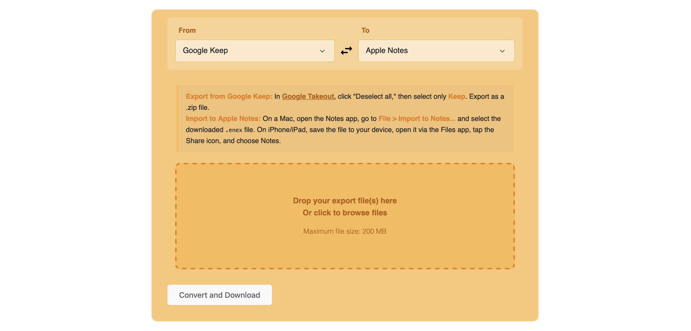

# Note Migrator

A free, secure, browser-based tool to migrate your notes between popular services like **Google Keep**, **Apple Notes**, **Evernote**, and **Notion**. All processing happens entirely in your browser, ensuring your notes remain private.

**[Try it live!](https://notemigrator.mgks.dev/)**

## Key Features

*   **Privacy First:** Runs **entirely in your browser**. Your notes are never uploaded to any server.
*   **Multi-Format Conversion:**
    *   **From:** Google Keep, Evernote (.enex), Markdown (Notion exports).
    *   **To:** Apple Notes (.enex), Evernote (.enex), Markdown (Notion compatible).
*   **Easy to Use:** A simple, modern interface to select your "From" and "To" formats and drag-and-drop your exported files.
*   **Intelligent UI:**
    *   Dynamic instructions guide you on how to export from your source application.
    *   Automatic detection of `.zip` files to process notes and attachments seamlessly.
*   **Handles a Wide Range of Content:**
    *   Note titles and content (HTML and Markdown).
    *   Creation/modification dates (best effort parsing).
    *   Checklists (checked and unchecked items).
    *   Tags and labels.
    *   Embedded and referenced images from exports.
*   **No Installation Required:** Works directly in modern web browsers (Chrome, Firefox, Safari, Edge).
*   **Dark Mode Support:** Automatically respects your system theme, with a manual toggle available.

## How to Use

### Step 1: Choose Your Conversion Path

1.  Visit the **[Note Migrator](https://notemigrator.mgks.dev/)** website.
2.  Using the dropdown menus, select the service you are migrating **From** (e.g., Google Keep) and the service you are migrating **To** (e.g., Apple Notes).
3.  The instruction box will update automatically, guiding you on how to get your notes out of the source application.

### Step 2: Export Your Notes from the Source Service

Follow the on-screen instructions. Here are some examples:

*   **For Google Keep:**
    1.  Go to [Google Takeout](https://takeout.google.com/).
    2.  Click "**Deselect all**" and then select only "**Keep**".
    3.  Create and download the `.zip` export file.

*   **For Notion:**
    1.  In your Notion workspace, click "Settings & members" in the sidebar.
    2.  Go to "Settings" and find the "Export content" section.
    3.  Choose "Export all workspace content" and select **Markdown & CSV**.
    4.  Download the resulting `.zip` file.

### Step 3: Convert and Download

1.  Drag and drop the downloaded `.zip` file (or individual `.html`, `.enex`, `.md` files) onto the upload area on the Note Migrator page.
2.  The tool will process the files and prepare them for conversion.
3.  Click the "**Convert and Download**" button.
4.  Your browser will generate and download the converted notes in the correct format for your destination service.

### Step 4: Import Your Notes into the Destination Service

Follow the on-screen instructions for importing. For example, to import into **Apple Notes**:

*   **On Mac:** Open the **Notes** app, go to `File > Import to Notes...`, and select the downloaded `.enex` file.
*   **On iPhone/iPad:** Save the `.enex` file to your device (e.g., via AirDrop or Files), tap to open it, tap the **Share** icon, and choose the **Notes** app.

## Technology Stack

*   HTML5, CSS3, Vanilla JavaScript (ES6+)
*   [JSZip](https://stuk.github.io/jszip/) - For reading `.zip` files.
*   [Day.js](https://day.js.org/) - For date parsing and formatting.
*   [Turndown](https://github.com/mixmark-io/turndown) - For converting HTML to Markdown.
*   [Marked](https://github.com/markedjs/marked) - For converting Markdown to HTML.

## Privacy

This tool is designed with privacy as a core principle. All processing happens locally in your web browser. Your note files are never uploaded to any external server. We use optional, anonymous Google Analytics to understand feature usage (e.g., which conversion paths are most popular) to improve the tool. No personal data or note content is ever collected.

## Contributing

Contributions are welcome! If you find a bug or have an idea for improvement, please open an issue or submit a pull request on the [GitHub repository](https://github.com/mgks/NoteMigrator).

## License

This project is open source and available under the [MIT License](LICENSE).